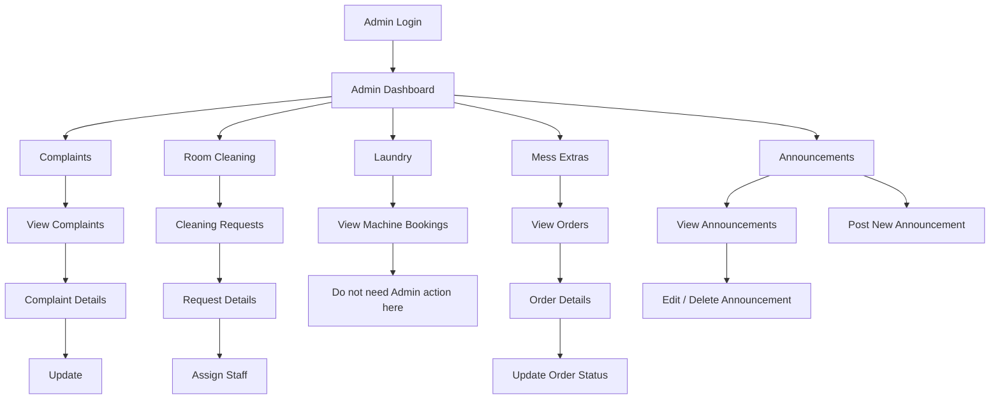

# writing on oct 13,this is the adminflow designed for the initial project idea

```mermaid
flowchart TD
    A[Admin Login] --> B[Admin Dashboard]

    B --> C[Complaints]
    B --> D[Room Cleaning]
    B --> E[Laundry]
    B --> G[Mess Extras]
    B --> H[Announcements]

    C --> C1[View Complaints]
    C1 --> C2[Complaint Details]
    C2 --> C3[Update]

    D --> D1[Cleaning Requests]
    D1 --> D2[Request Details]
    D2 --> D3[Assign Staff ]

    E --> E1[View Machine Bookings]
    E1 --> E2[Do not need Admin action here]

    G --> G1[View Orders]
    G1 --> G2[Order Details]
    G2 --> G3[Update Order Status]

    H --> H1[View Announcements]
    H --> H2[Post New Announcement]
    H1 --> H3[Edit / Delete Announcement]

```