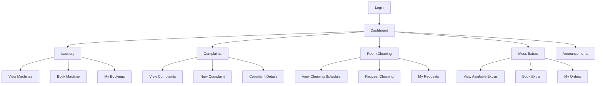

```mermaid
flowchart TD
    A[Login] --> B[Dashboard]

    B --> C[Laundry]
    B --> D[Complaints]
    B --> E[Room Cleaning]
   
    B --> G[Mess Extras]
    B --> H[Announcements]

    C --> C1[View Machines]
    C --> C2[Book Machine]
    C --> C3[My Bookings]

    D --> D1[View Complaints]
    D --> D2[New Complaint]
    D --> D3[Complaint Details]

    E --> E1[View Cleaning Schedule]
    E --> E2[Request Cleaning]
    E --> E3[My Requests]

    G --> G1[View Available Extras]
    G --> G2[Book Extra]
    G --> G3[My Orders]


```
